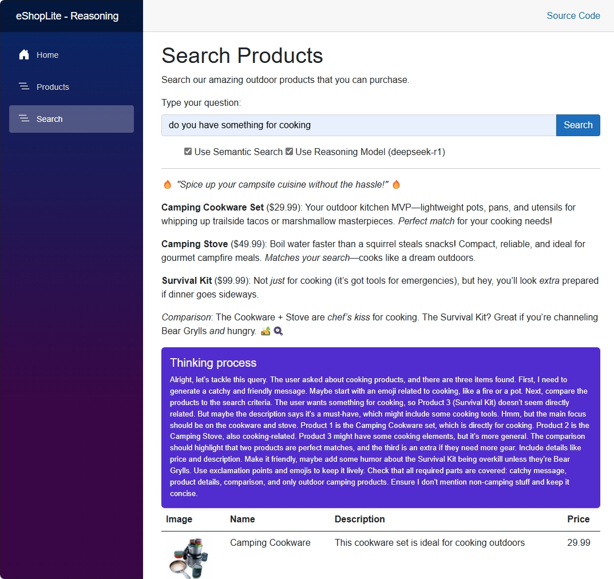

# eShopLite - DeepSeek Integration Documentation

This documentation provides detailed technical information about the eShopLite DeepSeek scenario, including DeepSeek-R1 model integration, dual AI provider setup, and advanced reasoning capabilities.

## Overview

The 05-deepseek scenario demonstrates a sophisticated eCommerce platform that integrates both Azure OpenAI and DeepSeek-R1 models, showcasing how to leverage multiple AI providers for enhanced reasoning and semantic search capabilities.

## Features Documentation

- [Aspire Orchestration](./aspire-orchestration.md) - .NET Aspire service composition with multiple AI providers
- [DeepSeek-R1 Integration](./deepseek-r1-integration.md) - DeepSeek-R1 model configuration and usage
- [Dual AI Provider Setup](./dual-ai-provider-setup.md) - Managing multiple AI clients simultaneously
- [Azure OpenAI Integration](./azure-openai-integration.md) - Traditional Azure OpenAI services
- [Memory Context with Reasoning](./memory-context-reasoning.md) - Enhanced vector search with reasoning
- [Advanced Search Capabilities](./advanced-search-capabilities.md) - Reasoning-enhanced product discovery

## Architecture Components

### Core Services
- **Products Service**: Enhanced API with dual AI provider support
- **Store Service**: Frontend web application
- **SQL Server**: Product database with persistence
- **Azure OpenAI**: GPT-4.1-mini and text-embedding-ada-002
- **DeepSeek-R1**: Advanced reasoning model for complex queries

### Key Technologies
- **.NET Aspire**: Cloud-native orchestration
- **DeepSeek-R1**: Advanced reasoning and analysis capabilities
- **Azure OpenAI**: Traditional chat and embedding services
- **Dual Provider Architecture**: Keyed services for multiple AI clients
- **Microsoft Kernel Memory**: Vector operations and semantic search

## AI Model Configuration

### Azure OpenAI Models
- **Chat Model**: gpt-4.1-mini (2025-04-14)
- **Embedding Model**: text-embedding-ada-002 (version 2)

### DeepSeek Models  
- **Reasoning Model**: DeepSeek-R1
- **Purpose**: Advanced reasoning and complex query analysis

### Service Registration
```csharp
// Azure OpenAI Chat Client
builder.Services.AddActivatedKeyedSingleton<ChatClient>(chatClientNameOpenAI, (sp, _) => 
{
    var client = sp.GetRequiredService<OpenAIClient>();
    return client.GetChatClient(deploymentNameAzureOpenAIChat);
});

// DeepSeek-R1 Chat Client
builder.Services.AddActivatedKeyedSingleton<ChatClient>(chatClientNameDeepSeekR1, (sp, _) =>
{
    // DeepSeek-R1 client configuration
    var credential = new DefaultAzureCredential();
    var client = new AzureOpenAIClient(endpoint, credential);
    return client.GetChatClient(deploymentNameDeepSeekR1);
});
```

## Configuration Management

### Secret Sections
- **openai**: Azure OpenAI connection configuration
- **deepseekr1**: DeepSeek-R1 service configuration

### Environment Variables
- `AI_ChatDeploymentName`: "gpt-41-mini"
- `AI_embeddingsDeploymentName`: "text-embedding-ada-002"

### Authentication Methods
- **Azure OpenAI**: API key or Managed Identity
- **DeepSeek-R1**: API key or Azure Default Credential

## Advanced Capabilities

### Reasoning-Enhanced Search
The DeepSeek-R1 integration enables:
- **Complex Query Analysis**: Deep understanding of user intent
- **Contextual Reasoning**: Sophisticated product matching logic
- **Multi-step Inference**: Advanced reasoning chains for product discovery

### Dual AI Strategy
- **Azure OpenAI**: Fast embeddings and standard chat operations
- **DeepSeek-R1**: Complex reasoning and analytical tasks
- **Intelligent Routing**: Automatic selection of appropriate AI provider

## Service Architecture
```
Store (Frontend)
  └── Products (API)
      ├── SQL Server Database
      ├── Azure OpenAI
      │   ├── GPT-4.1-mini (Chat)
      │   └── text-embedding-ada-002 (Embeddings)
      └── DeepSeek-R1
          └── DeepSeek-R1 (Reasoning)
```

## Screenshots

### Aspire Dashboard


### Products Listing


### DeepSeek Reasoning Search


## Key Features

### Enhanced Product Discovery
- Reasoning-based product matching
- Complex query understanding
- Contextual product recommendations
- Multi-criteria product analysis

### Dual AI Provider Benefits
- **Performance Optimization**: Use optimal model for each task
- **Capability Enhancement**: Leverage strengths of different AI providers
- **Fallback Strategy**: Resilience through provider redundancy

### Advanced Integration Patterns
- Keyed service registration for multiple AI clients
- Flexible authentication strategies
- Configuration-driven AI provider selection

## Getting Started

1. Configure both Azure OpenAI and DeepSeek-R1 user secrets
2. Ensure proper authentication for both services
3. Run from the scenario's src directory:
   ```bash
   cd src/eShopAppHost
   dotnet run
   ```
4. Test both traditional search and reasoning-enhanced search capabilities

## Related Resources

- [Main Scenario README](../README.md)
- [DeepSeek-R1 Documentation](https://www.deepseek.com/)
- [Azure OpenAI Service](https://azure.microsoft.com/en-us/products/cognitive-services/openai-service/)
- [.NET Aspire Documentation](https://learn.microsoft.com/en-us/dotnet/aspire/)