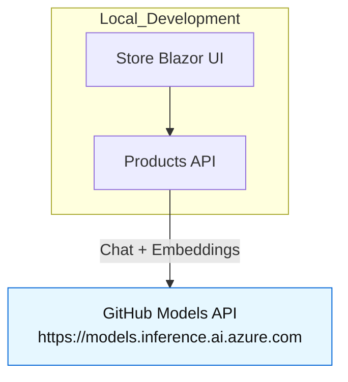
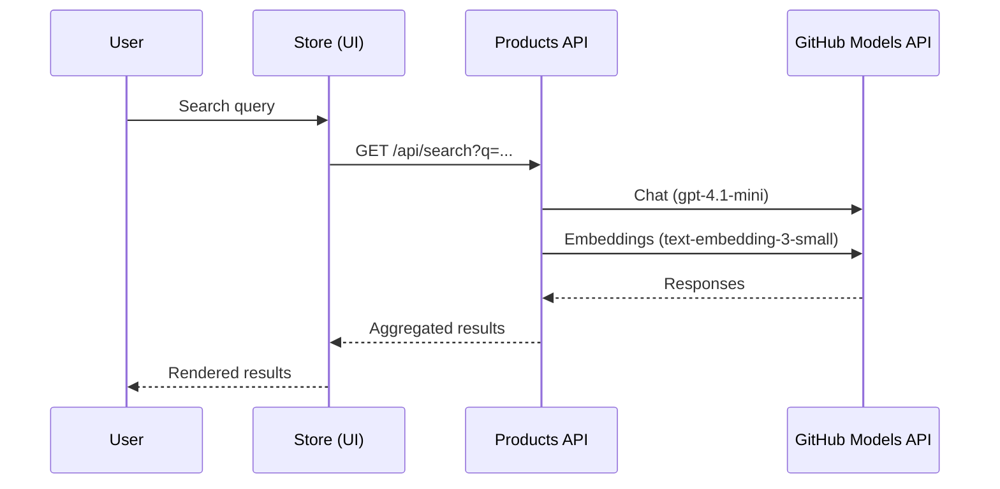

# eShopLite Scenario 11 — GitHub Models (local-first)

[](/LICENSE)

This scenario runs eShopLite locally using GitHub Models for chat and embeddings. When you publish/deploy, the app automatically uses Azure OpenAI without code changes. All deployment, telemetry, costs, and security guidance live in Scenario 01 and are not duplicated here.

- What you get here: local-first GitHub Models setup and how it switches automatically
- What to read in Scenario 01: Azure deployment, telemetry, costs, and security

Quick links:

- Features
- How it works
- Prerequisites
- Run locally
- Architecture and request flow
- Troubleshooting
- Resources

## Features (Scenario 11)

- Local-first AI via GitHub Models with .NET Aspire
- Automatic switch to Azure OpenAI when published/deployed
- Secure interactive GitHub token prompt (Aspire parameters)
- Same Store UI and Products API behavior across environments

## How it works

Local development uses GitHub Models; publish/deploy uses Azure OpenAI. The Products service toggles via Aspire-provided environment settings:

- AI_UseGitHubModels: true for local; false for publish/deploy
- GitHubToken: GitHub Personal Access Token used locally for GitHub Models
- Endpoint (local): [https://models.inference.ai.azure.com](https://models.inference.ai.azure.com)

## Prerequisites (local dev only)

- .NET 9 SDK and .NET Aspire tooling
- Docker Desktop or Podman (recommended)
- GitHub account and access to GitHub Models
- A GitHub Personal Access Token (PAT) with access to GitHub Models

## Run locally

Run from the AppHost so Aspire wires service URLs and secure parameters for you.

```powershell
cd ./src/eShopAppHost/
dotnet run
```

During the first run, Aspire prompts for your GitHub token as a secure parameter. The app then uses:

- Chat: gpt-4.1-mini (GitHub Models)
- Embeddings: text-embedding-3-small (GitHub Models)

When you publish/deploy (see Scenario 01), the app uses Azure OpenAI deployments instead:

- Chat: gpt-4.1-mini (Azure OpenAI)
- Embeddings: text-embedding-ada-002 (Azure OpenAI)

## Architecture (local)



### Request flow (local)



## Troubleshooting (local)

- Ensure Docker/Podman is running if containers are required by Aspire resources
- If the token prompt doesn’t appear, verify you’re running from the AppHost project
- If you prefer using Azure OpenAI locally, set AI_UseGitHubModels=false and configure Azure OpenAI per Scenario 01

## Deployment, telemetry, costs, and security

This scenario intentionally keeps those topics centralized in Scenario 01. For complete guidance, follow:

- Scenario 01 README: ../../01-SemanticSearch/README.md
- Scenario 01 Docs: ../../01-SemanticSearch/docs/README.md

## Resources

- GitHub Models: gpt-4.1-mini — <https://github.com/marketplace/models/azure-openai/gpt-4-1-mini>
- GitHub Models: text-embedding-3-small — <https://github.com/marketplace/models/azure-openai/text-embedding-3-small>

Video

- Run eShopLite Semantic Search in Minutes with .NET Aspire & GitHub Codespaces: <https://youtu.be/T9HwjVIDPAE>
