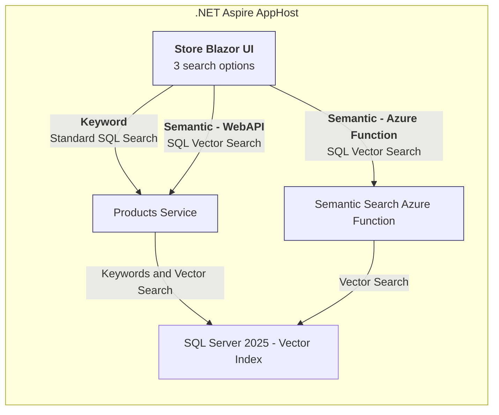
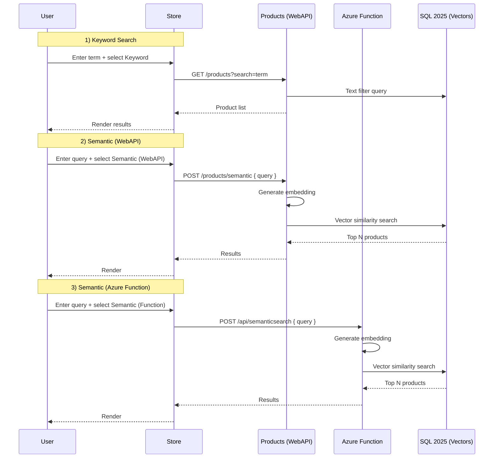

](/LICENSE)

# eShopLite – Store + Products + Semantic Search (.NET Aspire)

This repository contains a simplified e‑commerce sample (Store frontend + Products backend) extended with Semantic Search capabilities. The solution demonstrates:

* Orchestration and service discovery using **.NET Aspire AppHost**
* Three different product search experiences in the Store UI
* Re–use of SQL Server 2025 vector search capabilities (single mention). For detailed guidance about SQL Server 2025 vector features, indexing, and setup, see the Scenario 08 documentation: `../08-Sql2025/README.md`.
* Optional Azure Functions façade for semantic search

> NOTE: Detailed inner workings of SQL Server 2025 vector indexes and setup are out of scope in this README. For comprehensive guidance about SQL Server 2025 vector capabilities and setup, please refer to Scenario 08: `../08-Sql2025/README.md`.

## Table of contents

* [Search Features](#search-features)
* [Architecture](#architecture)
  * [High level (Mermaid)](#high-level-mermaid)
  * [Search flows](#search-flows)
* [Projects](#projects)
* [Configuration](#configuration)
* [Running locally](#running-locally)
* [Search modes in detail](#search-modes-in-detail)
* [Scenario 01 Guidance & Costs](#scenario-01-guidance--costs)
* [Troubleshooting](#troubleshooting)
* [Contributing](#contributing)
* [License](#license)

## Search Features

The Store UI exposes 3 search options (dropdown / selector on the Search page):

1. Keyword Search (standard text filtering)  
    *Implementation:* `Products` API endpoint in `src/Products/Endpoints/ProductApiActions.cs` (e.g. simple `WHERE` / LINQ filtering).
2. Semantic Search (direct API)  
    *Implementation:* Products API builds an embedding, performs SQL Server 2025 vector similarity query; defined in `ProductApiActions.cs`.
3. Semantic Search via Azure Function  
    *Implementation:* Store calls `SemanticSearchFunction` (`src/SemanticSearchFunction/Functions/SearchFunction.cs`), which performs the same underlying SQL vector similarity, returning top matches.

Animated examples were previously provided as GIFs; if/when assets are added back place them under `./images/` and reference here. For now the flows are described below.

## Architecture

### High level (Mermaid)



### Search flows



## Projects

| Project | Purpose |
| ------- | ------- |
| `src/eShopAppHost` | Aspire AppHost orchestrating services (service discovery, lifecycles). |
| `src/Store` | Front-end (Blazor) calling Products API & Azure Function. |
| `src/Products` | Product catalog API, keyword + direct semantic search (vector). |
| `src/SemanticSearchFunction` | Azure Function exposing semantic search endpoint. |
| `src/DataEntities`, `src/SearchEntities` | Data contract / model assemblies. |
| `src/eShopServiceDefaults` | Shared service discovery + resilience registrations (`AddServiceDefaults`). |
| `tests` projects | Unit tests (`Products.Tests`, `SemanticSearch.Tests`). |

## Configuration

Primary settings affecting search:

| Setting | Where | Description |
| ------- | ----- | ----------- |
| `SemanticSearchFunctionEndpoint` | Store `appsettings.*` | Optional override of service discovery for the Azure Function (e.g. `http://localhost:7071/`). |
| `ProductEndpoint` | Store `appsettings.*` | Legacy; usually replaced by service discovery `https+http://products`. |
| Connection strings | Function & Products | Access to SQL Server instance containing product + vector data. |

When using Aspire service discovery you can omit concrete host/ports and use `https+http://{servicename}` URIs in `BaseAddress`.

## Running locally

1. Build & start via AppHost (preferred unified experience):

```powershell
dotnet run --project src/eShopAppHost
```

The dashboard lists services (Store, Products, SemanticSearchFunction, SQL). Open the Store UI, navigate to Search page.

1. Or run individually:

```powershell
dotnet run --project src/Products
func start --csharp src/SemanticSearchFunction  # or use VS Code Azure Functions tooling
dotnet run --project src/Store
```

Provide `SemanticSearchFunctionEndpoint` and `ProductEndpoint` if not using AppHost discovery.

## Search modes in detail

| Mode | Trigger | Code Path | Notes |
| ---- | ------- | --------- | ----- |
| Keyword | Selector: Keyword | `ProductApiActions` (standard endpoint) | Simple filter / LIKE logic. |
| Semantic (Direct) | Selector: Semantic (API) | `ProductApiActions` semantic endpoint | Embedding + vector distance query. |
| Semantic (Function) | Selector: Semantic (Azure Function) | `SearchFunction.cs` | Separate function; illustrates alternative deployment boundary / scaling unit. |

All semantic paths execute a SQL 2025 vector similarity search. For full technical documentation and implementation details, see Scenario 08: `../08-Sql2025/README.md`.

## Scenario 01 Guidance & Costs

Scenario 01 (this repository baseline) guidance, including cost considerations (compute/container sizing, Azure Function consumption vs dedicated, SQL Server licensing / vector feature resource usage) is centralized in:  
[`docs/scenario-01-guidance.md`](./docs/scenario-01-guidance.md)

Summary:

* Azure Function semantic search adds an independent scaling surface (can scale independently from Products service).
* Direct semantic search keeps latency slightly lower (1 less network hop) but couples functionality to Products deployment cadence.
* Use configuration to switch between service discovery and explicit endpoints for local debugging.

## Troubleshooting

| Issue | Tip |
| ----- | --- |
| Service name not resolving | Ensure running under AppHost or supply explicit endpoints. |
| Empty semantic results | Verify vectors initialized and embeddings dimension matches configuration. |
| Function 404 | Check route: `/api/semanticsearch` and that function host is running. |
| SSL issues locally | Use `https+http://` scheme for service discovery URIs or trust dev certs. |

## Contributing

Pull requests welcome. Ideas:
Pull requests welcome. Ideas:

* Health checks exposure & dashboards
* Add caching layer for embeddings
* Add benchmark comparing direct vs function semantic search latency
* UI toggle to show raw vector score

## License

MIT – see [LICENSE](./LICENSE)

---

Historical / deep SQL vector feature docs were removed to keep README focused. Only vector search capability mention retained per request.
